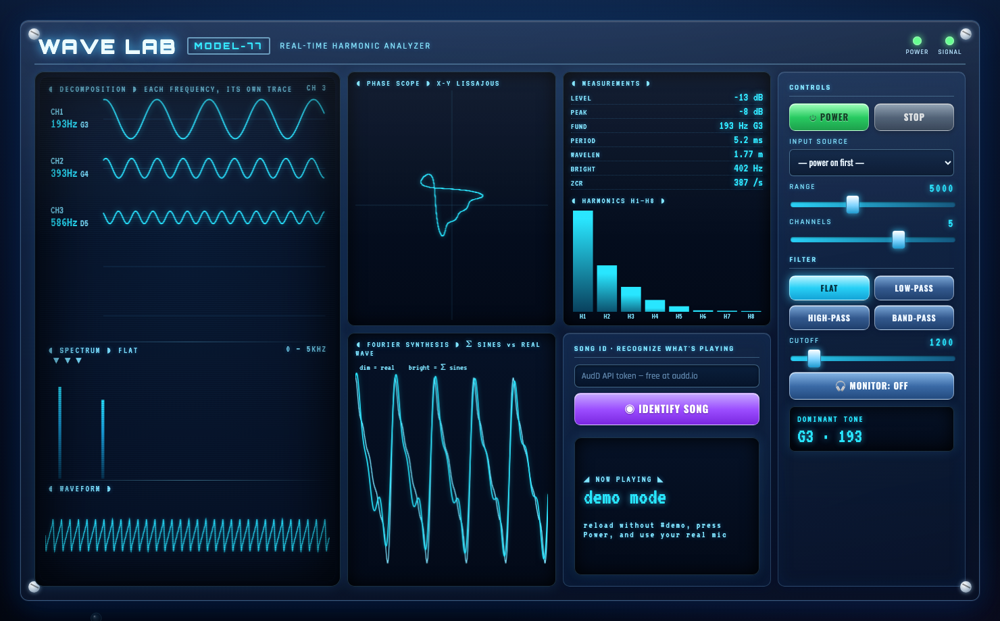

# 🌊 Wave Lab — Real-Time Harmonic Analyzer

A browser-based audio analyzer with a glossy Y2K aesthetic. Play any sound into
your mic and watch it broken into its sine-wave ingredients in real time — plus
filters, full wave analysis, and Shazam-style song recognition.



### ▶ Live demo (no install)
**https://pai-88.github.io/wave-lab-analyzer/live.html**

> Want to see it move without granting mic access? Open
> **[live.html#demo](https://pai-88.github.io/wave-lab-analyzer/live.html#demo)** —
> it auto-runs on a synthetic signal.

> Click **⏻ Power**, allow the microphone, and play some music nearby.
> Works on desktop and phone. (Mic needs HTTPS — the live link above is HTTPS, so you're good.)

---

## What it does

The single-screen dashboard (`live.html`) shows, live from your microphone:

- **Decomposition scope** — each dominant frequency drawn as its own travelling sine wave, labelled with note (e.g. `440 Hz · A4`)
- **Spectrum analyzer** — every sine wave present, strongest peaks marked
- **Waveform** — the raw sound over time
- **Phase scope** — X-Y Lissajous figure
- **Fourier synthesis** — the detected sines re-summed (real DFT, phase-aligned) overlaid on the real wave
- **Harmonics meter** — strength of H1–H8
- **Measurements** — level/peak (dB), fundamental, period, wavelength in air, spectral centroid ("brightness"), zero-crossing rate
- **Filters** — low / high / band-pass (live, with optional monitoring)
- **Song ID** — record a few seconds and recognize the track (title + artist + Spotify link)

## Run it locally

The mic only works over a secure context, so use a local server (not a `file://` double-click):

```bash
cd wave-lab-analyzer
python3 -m http.server 8000
# then open http://localhost:8000/live.html
```

## Song ID — how it works (and why it needs a token)

Spotify has **no "listen and identify" API**, so true recognition uses
[**AudD**](https://audd.io) — record → fingerprint → match against a song database.
Grab a free AudD API token, paste it into the **Song ID** box once (it's saved in your
browser's localStorage, never committed), then hit **Identify**. AudD returns the
Spotify song name, artist, album, and a link. The free tier is a limited number of
recognitions; after that it's pay-as-you-go.

## Also included

- **`wave_lab.py`** — a desktop (matplotlib) version: record from the mic and get the
  Fourier breakdown, plus a Laplace s-plane view.
  ```bash
  pip install numpy scipy matplotlib sounddevice soundfile
  python3 wave_lab.py devices            # list mics
  python3 wave_lab.py live --device 3    # real-time window
  python3 wave_lab.py record --seconds 20 --device 3
  ```
- **`wave_lab_colab.ipynb`** — a Google Colab notebook (live spectrum, filters, and an
  ML pitch-detection demo). `build_colab.py` generates it.

## How it works

Pure HTML/CSS/JS — no build step, no dependencies. Audio via the Web Audio API
(`AnalyserNode` FFT for the spectrum, a hand-rolled DFT for phase-accurate synthesis),
rendered to `<canvas>`. Everything runs client-side.

## License

MIT
