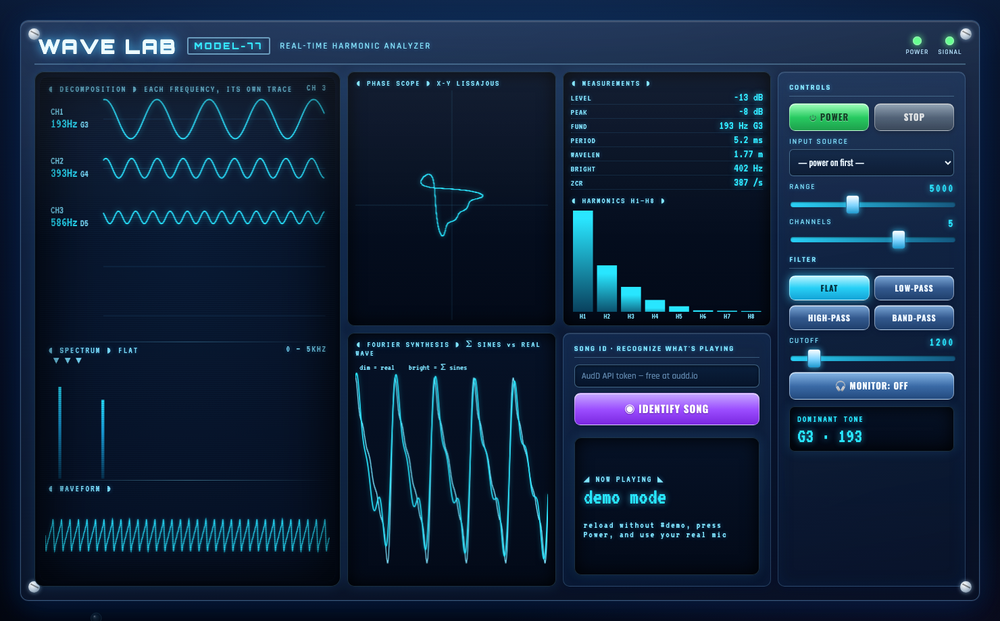

# Wave Lab

A real-time harmonic analyser that runs in the browser. It takes microphone input and shows the sound split into its component sine waves as it plays.



**Live:** https://paingheinhtet.com/wave-lab-analyzer/live.html. Click Power and allow the microphone. To run it on a synthetic signal without the microphone, open [live.html#demo](https://paingheinhtet.com/wave-lab-analyzer/live.html#demo).

## What it shows

- **Decomposition:** each dominant frequency drawn as its own sine wave, labelled with its note (e.g. `440 Hz · A4`)
- **Spectrum:** all frequency components, with the strongest peaks marked
- **Waveform** and an **X-Y phase plot** (Lissajous figure)
- **Fourier resynthesis:** the detected sines summed back together (real DFT, phase-aligned) and overlaid on the input
- **Harmonics:** relative strength of H1 to H8
- **Measurements:** level and peak (dB), fundamental, period, wavelength in air, spectral centroid, zero-crossing rate
- **Filters:** low-pass, high-pass and band-pass, applied live
- **Song ID:** records a few seconds and identifies the track through the [AudD](https://audd.io) API
- **Sound classification:** YAMNet running in the browser with TensorFlow.js (521 sound classes, no server)

## How it works

Plain HTML, CSS and JavaScript with no build step. Audio comes from the Web Audio API: `AnalyserNode` provides the FFT for the spectrum, and a hand-written DFT provides phase for the resynthesis. Everything is drawn to `<canvas>` and runs client-side.

## Running locally

Browsers only allow microphone access from a secure context, so serve the folder rather than opening the file directly:

```bash
python3 -m http.server 8000
# open http://localhost:8000/live.html
```

Song ID needs a free AudD API token, entered once in the Song ID box. It is stored in the browser's localStorage and never committed.

## Also included

- `wave_lab.py`: a desktop version (matplotlib) that records from the microphone and shows the Fourier breakdown and a Laplace s-plane view.
  ```bash
  pip install numpy scipy matplotlib sounddevice soundfile
  python3 wave_lab.py devices            # list microphones
  python3 wave_lab.py live --device 3
  ```
- `wave_lab_colab.ipynb`: a Colab notebook with a live spectrum, filters and a pitch-detection demo, generated by `build_colab.py`.

## Licence

MIT
